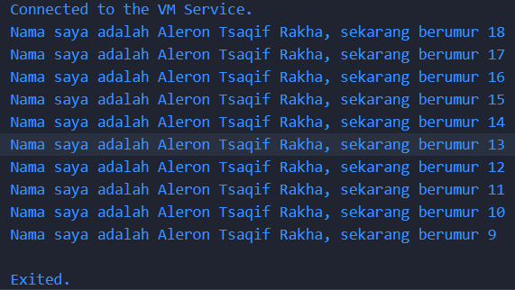

# Tugas Praktikum Pertemuan 2

1. Modifikasi Kode  
   **Code :**

```
void main() {
  for (int i = 18; i >= 9; i--) {
    print('Nama saya adalah Aleron Tsaqif Rakha, sekarang berumur ${i}');
  }
}
```

**Hasil :**  


2. Mengapa sangat penting untuk memahami bahasa pemrograman Dart sebelum kita menggunakan framework Flutter ? Jelaskan!  
   **Jawab**

   - Dart merupakan bahasa yang digunakan untuk menggunakan framework Flutter. Memahami dasar-dasar Dart, kelebihan dan perbedaannya dari bahasa lain akan mempermudah dan meningkatkan produktivitas pengerjaan project dengan framework Flutter. Karena pengembangan Flutter melibatkan pemahaman mendalam mengenai Dart.

3. Rangkumlah materi dari codelab ini menjadi poin-poin penting yang dapat Anda gunakan untuk membantu proses pengembangan aplikasi mobile menggunakan framework Flutter.  
   **Jawab**
   - **Dart** adalah bahasa yang perlu dipahami sebelum dapat mencoba menggunakan **Flutter**. Dart merupakan bahasa yang fleksibel karena menggabungkan beberapa kelebihan yang dimiliki bahasa pemrograman terkini.
   - Dart merupakan `Type safe general purpose programming language`, yang di desain untuk membangun aplikasi dengan lebih cepat dan mengurangi run time error pada aplikasi yang sedang dibangun.
   - Memiliki operasi JIT compiler (Just-In-Time Compilation) yang dapat memuat dan mengkompilasi source code kita menjadi machine code (native). JIT merupakan pendekatan untuk menjalankan kode pada _command line_ atau selama proses pengembangan sehingga masih dapat dilakukan _debugging_ dan _hot reload_.
   - Memiliki operasi AOT compiler (Ahead-Of-Time) selain JIT. AOT bekerja dengan Dart VM dan kode dikomilasi sebelumnya, pendekatan AOT memiliki keuntungan performa yang lebih besar dibandingkan JIT, namun tidak memiliki fitur _debugging_ dan _hot reload_.
   - Garbage collection untuk mengelola dealokasi memori secara otomatis.
   - `Portability` bahasa dart dapat dikompilasi secara native ke ARM dan x86
   - Dalam _relational operators_ Dart, `==` tidak membandingkan referensi/alamat memori melainkan isi dari variabel tersebut dan memastikan `==` hanya digunakan pada objek dengan tipe data yang sama. Tidak seperti JavaScript yang memerlukan `===` untuk memastikan tipe datanya.
4. Soal 4  
   **Link :**  
   https://docs.google.com/presentation/d/1qqRY2ID93Igc_u4RjrSO5qAmaw0IZ8WPbaZkE392IJ0/edit?usp=sharing
