
||

**Jurusan Teknologi Informasi Politeknik Negeri Malang**

**Jobsheet : Pertemuan 3 – Pengantar Dart #2**

**Mata Kuliah Pemrograman Mobile**

**Pengampu** : **Dian Hanifudin Subhi, S.Kom., M.Kom.**

**Email Pengampu :** <dhanifudin@polinema.ac.id> 
|
| - | - |

**Praktikum 1 Penerapan If Else**

**Langkah 1**

Memasukkan kode dalam main()

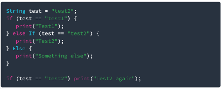

**Langkah 2**

Lakukan Run terhadap kode tersebut. Apa yang terjadi? Jelaskan!

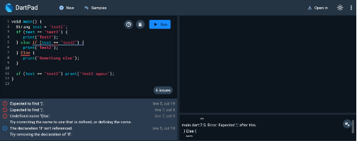

Hasil sebelum run sudah menunjukkan bahwa adanya error, karena tidak ada nama ‘else If’ dan ‘Else’ pada dart. Sehingga jika di run tidak akan memunculkan apa apa melainkan pesan error.

**Langkah 3**

Tambahkan kode program berikut, lalu coba eksekusi (Run) kode Anda.

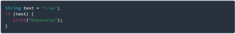

Apa yang terjadi ? Jika terjadi error, silakan perbaiki namun tetap menggunakan if/else.

Tetap error karena else If dan Else tadi belum diperbaiki, jika error telah diperbaiki maka akan menjadi seperti :

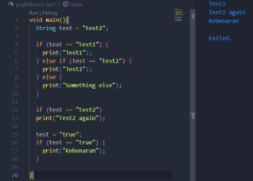 

menghilangkan tipe data ‘String’ ke-dua karena variabel setelah di define maka tidak perlu di define ulang.

**Praktikum 2 Penerapan Perulangan While dan Do-while**

**Langkah 1**

Ketik atau salin kode program berikut ke dalam fungsi main().

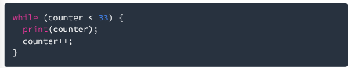

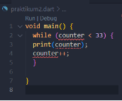**

**Langkah 2**

Silakan coba eksekusi (Run) kode pada langkah 1 tersebut. Apa yang terjadi? Jelaskan! Lalu perbaiki jika terjadi error.

Error jika dijalankan karena variabel counter belum di define tipe datanya sehingga komputer tidak dapat mengerti nilai counter. Jika diperbaiki maka :

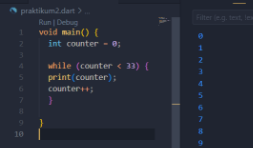 

dan hasil run akan mencapai angka 32.

**Langkah 3**

Tambahkan kode program berikut, lalu coba eksekusi (Run) kode Anda.

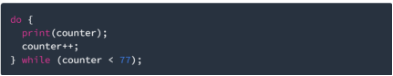

Apa yang terjadi ? Jika terjadi error, silakan perbaiki namun tetap menggunakan *do-while*.

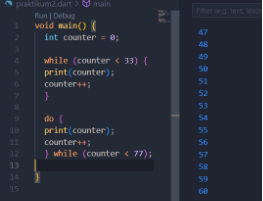

Akan menghasilkan nilai hingga angka 76 dan tidak error.

**Praktikum 3 Penerapan Perulangan For dan Break-continue**

**Langkah 1**

Ketik atau salin kode program berikut ke dalam fungsi main().

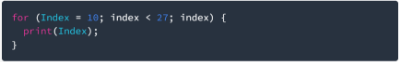

**Langkah 2**

Silakan coba eksekusi (Run) kode pada langkah 1 tersebut. Apa yang terjadi? Jelaskan! Lalu perbaiki jika terjadi error.

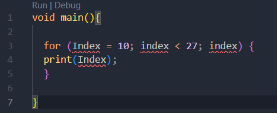

Error karena variabel belum memiliki tipe data. Kemudian dari variabel yang di define awal adalah “Index” tapi ada parameter lain yaitu “index” dalam perulangan sehingga terjadi case sensitive. Untuk menghindari infinite loop maka pada variabel akhir harus ditambahkan operator pertambahan ++.

**Jika diperbaiki maka :**

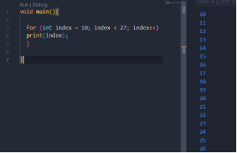

Menambahkan data type, memperbaiki ejaan variabel agar sama dan menambahkan operasi pertambahan “++” agar tidak terjadi infinite loop.

**Langkah 3**

Tambahkan kode program berikut di dalam *for-loop*, lalu coba eksekusi (Run) kode Anda.

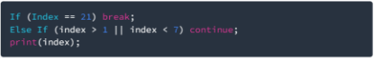

Error karena If diawali kapital, Else diawali kapital dan tidak ada “{}” untuk mengisi kondisi  if maupun else if statement. Sehingga jika diperbaiki maka:
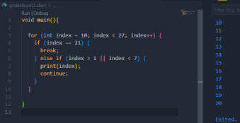

**Tugas Praktikum**

1. Silakan selesaikan Praktikum 1 sampai 3, lalu dokumentasikan berupa screenshot hasil pekerjaan beserta penjelasannya!
1. Buatlah sebuah program yang dapat menampilkan bilangan prima dari angka 0 sampai 201 menggunakan Dart. Ketika bilangan prima ditemukan, maka tampilkan nama lengkap dan NIM Anda.

   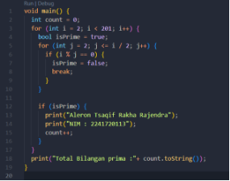 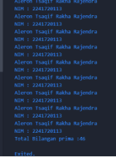

   Total ada 46 bilangan prima.

1. Kumpulkan berupa link commit repo GitHub pada tautan yang telah disediakan di grup Telegram!

