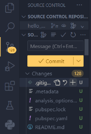
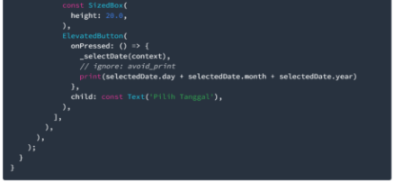
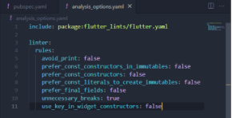
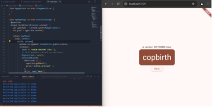

||

**Jurusan Teknologi Informasi Politeknik Negeri Malang**

**Jobsheet : Pertemuan 5 – Aplikasi Pertama dan Widget dasar Flutter**

**Mata Kuliah Pemrograman Mobile**

**Pengampu** : **Dian Hanifudin Subhi, S.Kom., M.Kom.**

**Email Pengampu :** <dhanifudin@polinema.ac.id> 
|
| - | - |

Aleron Tsaqif Rakha Rajendra

3G - 05

**Praktikum 1 – Membuat Project Flutter Baru**

**Langkah 1**

Buka VS Code, lalu tekan tombol **Ctrl + Shift + P** maka akan tampil *Command Palette*, lalu ketik **Flutter**. Pilih **New Application Project**.

**Langkah 2**

Kemudian buat folder **sesuai style** laporan praktikum yang Anda pilih. Disarankan pada folder dokumen atau desktop atau alamat folder lain yang tidak terlalu dalam atau panjang. Lalu pilih **Select a folder to create the project in**.

**Langkah 3**

Buat nama project flutter **hello\_world** seperti berikut, lalu tekan **Enter**. Tunggu hingga proses pembuatan project baru selesai.

**Langkah 4**

Jika sudah selesai proses pembuatan project baru, pastikan tampilan seperti berikut. Pesan akan tampil berupa "**Your Flutter Project is ready!**" artinya Anda telah berhasil membuat project Flutter baru.

**Praktikum 2 – Menghubungkan Perangkat Android atau Emulator**

**Mengaktifkan USB Debug**

Link how to : <https://developer.android.com/codelabs/basic-android-kotlin-compose-connect-device?hl=id#0> 

Agar Android Studio dapat berkomunikasi dengan perangkat Android, Anda harus mengaktifkan proses debug USB di setelan Opsi developer di perangkat.

Untuk menampilkan opsi developer dan mengaktifkan Proses debug USB:

1. Di perangkat Android, ketuk **Settings** > **About phone**.
1. Ketuk **Build number** tujuh kali.
1. Jika diminta, masukkan sandi atau PIN perangkat. Anda tahu Anda telah berhasil saat melihat pesan **You are now a developer!**.
1. Kembali ke Settings, lalu ketuk System > Developer options.
1. Jika Anda tidak melihat Developer options, ketuk Advanced options.

**Menginstall Driver USB Google**

1. Di Android Studio, klik **Tools > SDK Manager**. Dialog **Preferences > Appearance & Behavior > System Settings > Android SDK** akan terbuka.
1. Klik tab **SDK Tools**.
1. Pilih **Google USB Driver**, lalu klik **OK**.

   

**Praktikum 3 – Membuat Repository Github dan Laporan Praktikum**

**Langkah 1**

Login ke akun [GitHub](https://github.com/new) Anda, lalu buat repository baru dengan nama "**flutter-fundamental-part1**"

**Langkah 2**

Lalu klik tombol "**Create repository**" lalu akan tampil seperti gambar berikut.

**Langkah 3**

Kembali ke VS code, project flutter hello\_world, buka terminal pada menu **Terminal > New Terminal**. Lalu ketik perintah berikut untuk inisialisasi git pada project Anda.

**Langkah 4**

Pilih menu **Source Control** di bagian kiri, lalu lakukan **stages** (+) pada file **.gitignore** untuk mengunggah file pertama ke repository GitHub.

 

**Langkah 5**

Beri pesan commit "**tambah gitignore**" lalu klik **Commit** 

**Langkah 6**

Lakukan push dengan klik bagian menu titik tiga > **Push**

**Langkah 7**

Di pojok kanan bawah akan tampil seperti gambar berikut. Klik "**Add Remote**"

**Langkah 8**

Salin tautan repository Anda dari browser ke bagian ini, lalu klik **Add remote**, kemudian tulis remote dengan nama **origin**

\*pada kasus saya, hal tersebut tidak muncul sehingga harus dilakukan secara manual :

**Langkah 9**

Lakukan hal yang sama pada file **README.md** mulai dari Langkah 4. 

Setelah berhasil melakukan push, masukkan username GitHub Anda dan password berupa token yang telah dibuat (pengganti password konvensional ketika Anda login di browser GitHub).

**Langkah 10**

Push semua file dengan commit “project hello world”

**

**Langkah 11**

Kembali ke VS Code, ubah platform di pojok kanan bawah ke emulator atau device atau bisa juga menggunakan browser Chrome. Lalu coba running project **hello\_world** dengan tekan **F5** atau **Run > Start Debugging**.

 

**Langkah 12**

Silakan screenshot seperti pada Langkah 11, namun teks yang ditampilkan dalam aplikasi berupa nama lengkap Anda. Simpan file screenshot dengan nama **01.png** pada folder **images** (buat folder baru jika belum ada) di project hello\_world Anda. Lalu ubah isi README.md seperti berikut, sehingga tampil hasil screenshot pada file README.md. Kemudian push ke repository Anda.

**Praktikum 4 : Menerapkan Widget Dasar**

**Langkah 1**

Buat folder baru **basic\_widgets** di dalam folder **lib**. Kemudian buat file baru di dalam basic\_widgets dengan nama text\_widget.dart. Ketik atau salin kode program berikut ke project hello\_world Anda pada file text\_widget.dart.

Lakukan import file text\_widget.dart ke main.dart, lalu ganti bagian text widget dengan kode di atas. Maka hasilnya seperti gambar berikut. Screenshot hasil milik Anda, lalu dibuat laporan pada file README.md.

**Langkah 2**

Buat sebuah file image\_widget.dart di dalam folder basic\_widgets dengan isi kode berikut.

Lakukan penyesuaian asset pada file pubspec.yaml dan tambahkan file logo Anda di folder assets project hello\_world.

**Praktikum 5 - Menerapkan Widget Material Design dan iOS Cupertino**

**Langkah 1**

Buat file di basic\_widgets > loading\_cupertino.dart. Import stateless widget dari material dan cupertino. Lalu isi kode di dalam method Widget build adalah sebagai berikut.

**Langkah 2**

Button widget terdapat beberapa macam pada flutter yaitu ButtonBar, DropdownButton, TextButton, FloatingActionButton, IconButton, OutlineButton, PopupMenuButton, dan ElevatedButton.

Buat file di basic\_widgets > fab\_widget.dart. Import stateless widget dari material. Lalu isi kode di dalam method Widget build adalah sebagai berikut.

\*terjadi error tampilan dimana button thumbs up membuat halaman di atas halaman utama sehingga saya melakukan penyesuaian dan perubahan untuk code Floating Action Button.

**Langkah 3**

Scaffold widget digunakan untuk mengatur tata letak sesuai dengan material design.

Ubah isi kode main.dart seperti berikut.

\*Error terjadi pada line dengan code :

Sehingga dilakukan penyesuaian dengan perubahan :

Hasilnya :

**Langkah 4**

Dialog widget pada flutter memiliki dua jenis dialog yaitu AlertDialog dan SimpleDialog.

Ubah isi kode main.dart seperti berikut.

Hasil :

**Langkah 5**

Flutter menyediakan widget yang dapat menerima input dari pengguna aplikasi yaitu antara lain Checkbox, Date and Time Pickers, Radio Button, Slider, Switch, TextField.

Contoh penggunaan TextField widget adalah sebagai berikut:

Hasil :

**Langkah 6**

Date and Time Pickers termasuk pada kategori input dan selection widget, berikut adalah contoh penggunaan Date and Time Pickers.

Hasil :

**Laporan [Codelabs: Your first Flutter app**](https://codelabs.developers.google.com/codelabs/flutter-codelab-first#0)**

1. **Introduction**

   Pada Codelabs, kita akan mempelajari basic Flutter, cara membuat layout di Flutter, membuat user interactions, membuat aplikasi responsive

1. **Set up environment**

   Menggunakan Visual Studio Code sebagai developer environment. Dan melakukan Install Flutter SDK.

1. **Create first project**

   Membuat project flutter pada VSCode kemudian buka command palette dan membuat project flutter, beri nama flutter\_application\_1

   

   

   Buka pubspec.yaml dan modifikasi sesuai perintah

   

   Selanjutnya konfigurasi pada analysis\_options.yaml dan lakukan modifikasi

   

   Selanjutnya buka file main.dart di lib/ dan lakukan modifikasi

   

1. **Add button**

   Coba menjalankan main.dart

   

   Menambahkan kode :
   

   Perubahan :

   

   Memberi tambahan code :

   

   Modifikasi code :

   

   Maka akan menghasilkan tulisan yang berbeda setiap kita menekan button.

1. **Make the app prettier**

   Rewrite MyHomePage widget menjadi :

   

   Melakukan refactor code ‘Text’

   

   

   Ini akan memunculkan baris kelas baru,

   

   Lakukan refactor yang sama pada kata ‘Text’ namun pilih refactor **Wrap with padding**

   

   Maka akan memberikan pading padding pada teks :

   

   Refactor padding dengan **Wrap with widget**

   

   Kemudian ubah tulisan widget menjadi “Card” maka hasilnya :

   

   Melakukan ubahan code lagi dan ini hasilnya :

   

   Melakukan ubahan code lagi dan hasilnya akan seperti ini :

   

   Tambahan modifikasi code untuk membuat tulisan ke tengah :

   

   

1. **Add functionality**

   Pada bagian MyAppState, lakukan modifikasi :

   

   Modifikasi main.dart :

   

1. **Add navigation rail & New page**

   

